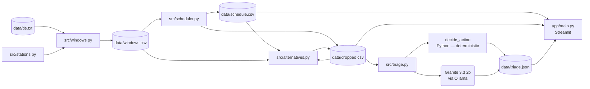

# orbital-contact-scheduler

The satellite ground station contacts scheduling system is for polar
orbiting meteorological satellites. Given the TLE elements and three
ground stations, it finds all the visibility windows for the satellites
within a 48 hour window period, schedules antenna usage by order of
importance of missions, and informs about dropped windows and their
next attempt times.

---

## Problem statement

A small network of ground stations versus a constellation of weather
satellites is a constrained resource assignment task. Each ground station
has only one antenna, satellites spend about 4-12 minutes over a station,
it’s impossible to serve two satellites simultaneously at the same
station, and the turnaround time for the antenna is 15 minutes between
contacts.

Given three ground stations and about 30 polar orbiting satellites
plus ISS flying overhead all the time, antenna time is very limited.
The scheduler needs to decide in advance which contacts to keep
and which to drop, taking into account the priority of the mission.
Once the contact plan is decided, operators must know which contacts
were dropped and can be recovered and which were lost forever, and
know how to react quickly in case of critical losses. The shape of this problem is not specific to satellites. Fixed capacity, more demand than the capacity can absorb, and a rule for deciding who waits describes crews against shifts, trucks against loading docks, and beds against patients just as well as antennas against passes.

---

## Solution description

The pipeline runs as four sequential Python scripts.

**1. `src/windows.py`** — visibility computation  
Uses [Skyfield](https://rhodesmill.org/skyfield/) to propagate TLE
elements and call `find_events` for every satellite/station pair across
the 48-hour window. Only complete passes (rise → optional culmination
→ set) above 10 degrees elevation are kept. Partial passes at the edges
of the search window are discarded. Output: `data/windows.csv` with one
row per satellite/station visibility window (satellite, station,
start_utc, end_utc, duration_min, max_elevation_deg).

**2. `src/scheduler.py`** — greedy priority scheduler  
Groups windows into orbital passes: two windows for the same satellite
belong to the same pass when their intervals overlap or their start
times are within 20 minutes of each other. Passes are then ordered by
(priority ascending, earliest start ascending). For each pass, candidate
stations are tried best-first by max elevation. The first station whose
antenna is free — clear of any existing booking by at least 15 minutes on
either side — is booked. If no station is free the whole pass is dropped
and the satellite that caused the most cumulative overlap is recorded as
`blocked_by`.

Priority values come from `src/stations.py`:

| Satellite | Priority |
|---|---|
| METOP-B | 1 |
| NOAA 20 (JPSS-1) | 1 |
| SUOMI NPP | 2 |
| METOP-C | 2 |
| ISS (ZARYA) | 3 |
| All others | 3 |

Output: `data/schedule.csv` (booked contacts) and `data/dropped.csv`
(dropped contacts, without alternative information yet).

**3. `src/alternatives.py`** — next-opportunity finder  
For each dropped pass, finds the same satellite's earliest subsequent
pass that is either already scheduled or has at least one station with a
free antenna (checked against the booked schedule plus any alternatives
already assigned earlier in the loop, to avoid double-assignment).
Adds five columns to `data/dropped.csv`: `alt_pass_id`, `alt_station`,
`alt_start_utc`, `delay_min`, `has_alternative`.

**4. `src/triage.py`** — AI triage  
Selects the 15 most operationally significant dropped passes, calls IBM
Granite for an explanation of each, and writes `data/triage.json`. See
the AI section below for how the model is used.

**`app/main.py`** — Streamlit dashboard  
Reads the three `data/` files only (never imports from `src/`) and
renders four sections: a metrics row, the AI triage panel, a Gantt chart
of booked contacts, and a filterable dropped-contacts table.

---

## AI approach and architecture

### Architecture



> The dashboard (`app/main.py`) reads only `data/schedule.csv`,
> `data/dropped.csv`, and `data/triage.json`. It never imports from
> `src/`. This means the frontend and the scheduling engine can be
> developed and tested independently.

The triage layer uses IBM Granite 3.3 2b, running locally via Ollama.
No API key and no cloud account are required.

**What Python computes — no model involved:**

- **Pass selection.** The top 15 dropped passes are ranked by priority
  ascending, then absence of alternative first, then delay descending.
  This is pure sorting in [`select_top()`](src/triage.py).

- **Action recommendation.** The `action` field (`ACCEPT`, `OVERRIDE`,
  or `ESCALATE`) is determined entirely by
  [`decide_action()`](src/triage.py), a short deterministic function:
  - No alternative + priority 1 or 2 → **OVERRIDE**
  - No alternative + priority 3 → **ESCALATE**
  - Alternative with delay > 120 min → **ESCALATE**
  - Alternative with delay ≤ 120 min → **ACCEPT**

- **Reason string.** The `reason` field (e.g. "Next opportunity is 287
  minutes away at Svalbard, a significant delay.") is a Python template
  built inside `decide_action()`, not generated by the model.

- **All numeric fields.** `pass_id`, `satellite`, `priority`,
  `delay_min`, `has_alternative`, and all aggregate statistics are
  computed in Python from the CSV data.

- **Summary statistics.** The numbers in the `summary` paragraph are
  computed by `_compute_stats()` and passed to the model as a prompt
  that instructs it to restate those facts without computing new figures.

**What the model generates:**

- The `explanation` field for each of the 15 items — a single sentence
  describing why the pass was dropped (which satellite occupied the
  antenna). The prompt supplies the structured context and asks for a
  JSON response with only an `explanation` key.

- The `summary` paragraph in `triage.json` — the model is given the
  exact statistics and asked to write a 3–5 sentence operator-facing
  paragraph restating them.

The model runs at temperature 0.1. On a bad JSON response, the code
retries once and then falls back to a Python-templated string, so
the pipeline completes even if Ollama is unreachable.

The decision logic is deterministic, auditable, and does not depend on
the model being available or producing consistent output. The model
handles narration only.

---

## Selected challenge theme

**August — Advance Space Exploration with AI**

This is an example of the usage of AI in the process of satellite
mission control. It uses a deterministic scheduler for time-sensitive
resource management and a language model to relieve the operator from
the need to read the drop record structure and to summarize the
operations performed — without the model being in the critical
decision path.

---

## How IBM Bob was used

Bob was the main development tool used on this project.

**Frontend (`app/main.py`).** The Streamlit interface was generated in
Bob from a specification of the data contract — the column names, types,
and JSON schema of the three files in `data/` — not from the source of
the engine that produced them. Bob outputted the complete 280 line-long
dashboard with a single pass: the metrics row, the layout of the triage
card row and its action badge colours, the Plotly `px.timeline` Gantt
chart, and the filtered dropped contacts table. Specifying against the
contract not against the implementation was how we were able to develop
the frontend and the engine in parallel, not blocking each other's
progress.

**Documentation.** Bob wrote this README from a structured
specification, reading `docs/DESIGN_NOTES.md` and `src/`. On being asked
which fields in `triage.json` are generated by the models and which by
Python code, Bob looked into `src/triage.py` and provided the split —
correcting an inaccurate description of the AI layer before it reached
this document.

**Backend (`src/`).** [Jenna to complete.]

---

## Results

| Metric | Value |
|---|---|
| Total passes considered | 1,267 |
| Scheduled | 280 (22.1%) |
| Dropped | 987 (77.9%) |
| Priority-1 passes scheduled | 63 / 65 |
| Dropped passes with an alternative | 688 |
| Median wait for alternatives | 464.9 minutes |
| Dropped passes with no alternative | 299 |

The scheduler's priority ordering ensures that lower-priority passes do not
displace priority-1 passes; however, in the case of two priority-1 satellites,
there may be competition for the same antenna. In the case of this run,
both METOP-B-031 and METOP-B-032 are prevented from accessing the antenna
by NOAA 20 (JPSS-1), which is also priority 1. This competition takes place
in the last part of the 48-hour planning window, hence there is no other
option and the pass gets dropped with `decide_action` giving it the action
value of OVERRIDE. Both appear as the top two items in the triage panel.

---

## Setup and run

### Prerequisites

- Python 3.11+
- [Ollama](https://ollama.com/) with `granite3.3:2b` — **only needed to
  regenerate `data/triage.json`**. The file is committed to the
  repository, so you can run the dashboard without Ollama installed.

### Install

```bash
git clone https://github.com/j05144/orbital-contact-scheduler
cd orbital-contact-scheduler
python -m venv .venv
# Windows
.venv\Scripts\activate
# macOS / Linux
source .venv/bin/activate

pip install -r requirements.txt
```

### Run the pipeline

Run the four scripts in order. Each writes to `data/` and the next
script reads from it.

```bash
# 1. Compute visibility windows  (~1–2 min for 48 h / 30 sats)
python src/windows.py

# 2. Schedule passes and record drops
python src/scheduler.py

# 3. Find next-opportunity alternatives for every dropped pass
python src/alternatives.py

# 4. Generate AI triage  (requires Ollama + granite3.3:2b)
#    Skip this step to use the committed data/triage.json
python src/triage.py
```

To force regeneration of triage even if `data/triage.json` is up to date:

```bash
python src/triage.py --force
```

### Launch the dashboard

```bash
streamlit run app/main.py
```

The dashboard opens at `http://localhost:8501`.
